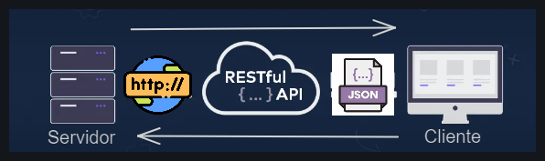
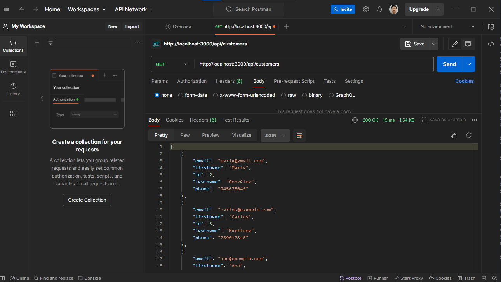
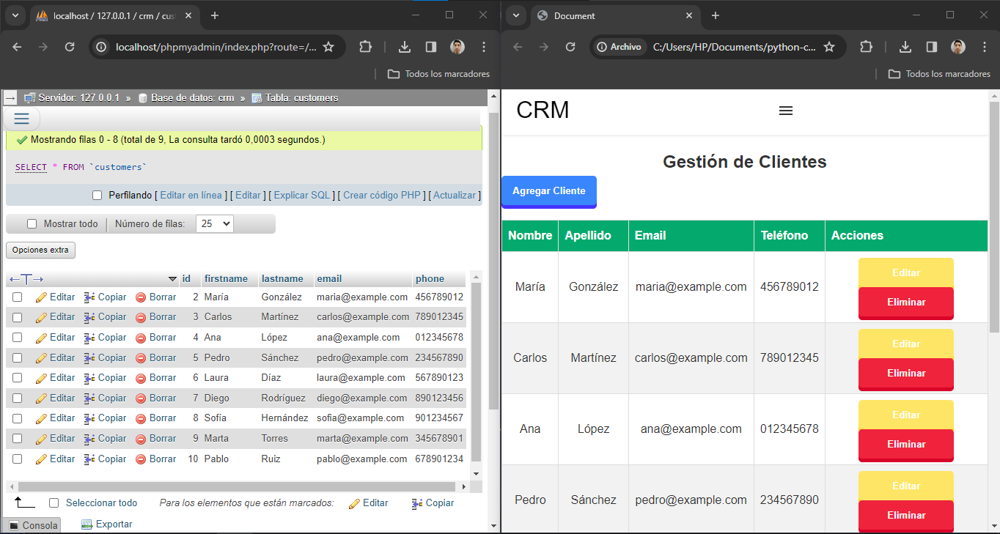
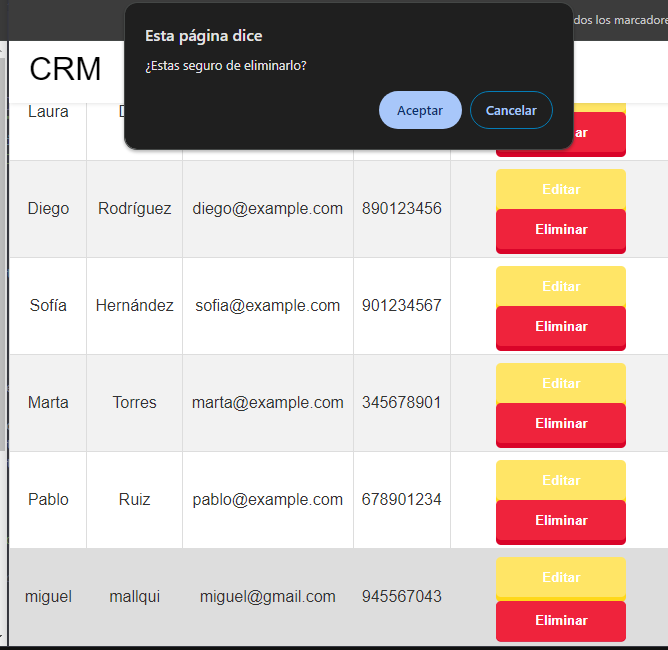
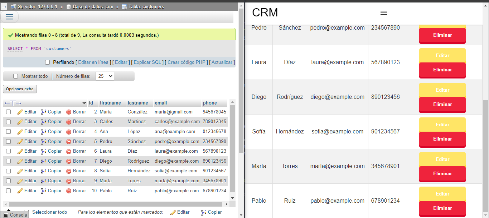
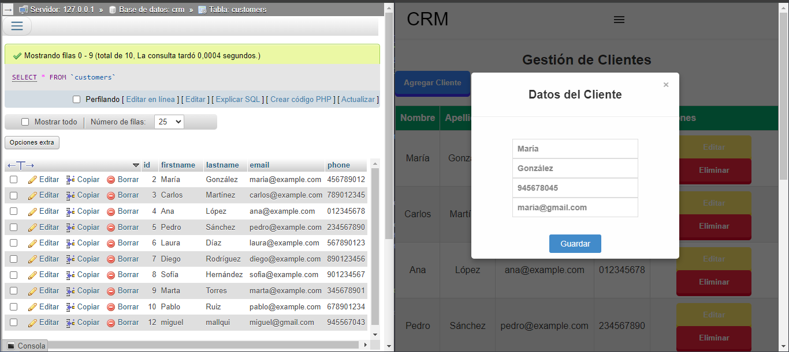
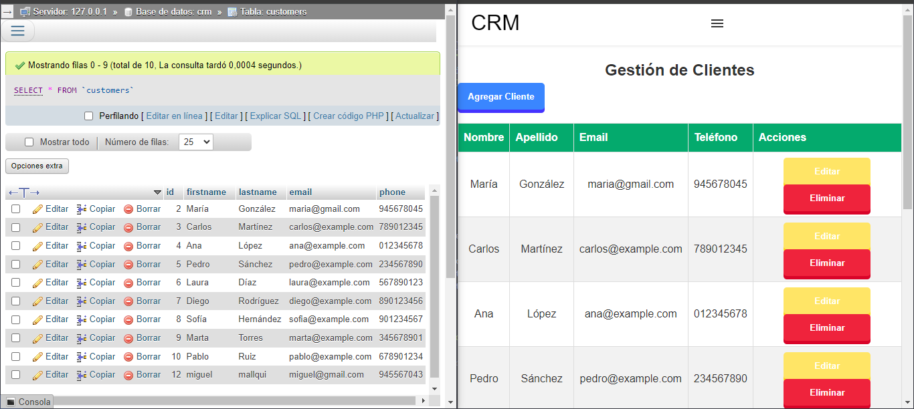
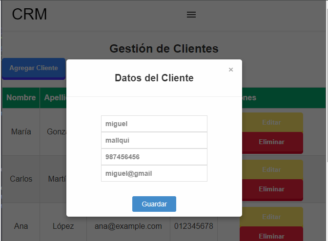
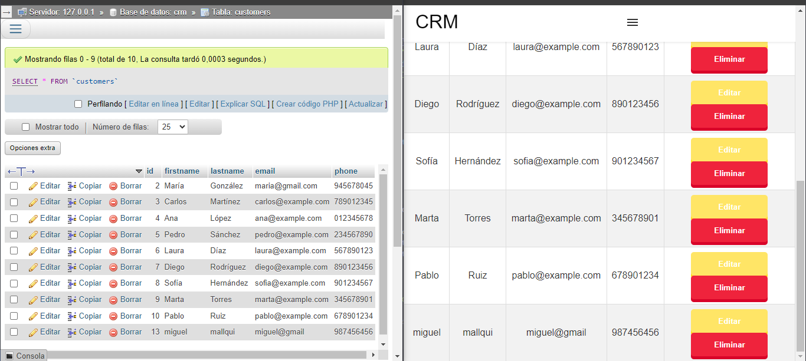

# Sistema de gestión de clientes con python y api restful con flask

Se desarrolló un sistema simple de gestión de clientes para que el usuario pueda realizar todas las operaciones CRUD(eliminar, editar, actualizar y agregar) de manera simple.

## Funcionalidades:

Como, por ejemplo, obtener todos los clientes que el Fronted solicita mediantes solicitudes HTTP como el GET y el Backend al recibir, consulta en la base de datos para obtener todo el listado y lo devuelve en formato JSON al Fronted para que el usuario pueda visualizar de manera simple. 

### Obtner clientes:
Para el Backend es más fácil comprobar desde Postman, me devuelve en formato JSON el listado de clientes. Además, me ayudo a identificar problemas al momento de crear un cliente, pero al final puedo resolverlo.

### Eliminar clientes:
Como se ve se elimina al cliente Miguel.

### Actualizar datos del cliente:
Se editó los datos de María.

### Agregar cliente:
Se agrego al cliente Miguel.

## Creación de Entorno virtual
- Crear un entorno virtual `python -m venv nombre-entorno`
- Activar el entorno virtual: primero debes estar en la carpeta customer-management y ejecutar el comando `.\nombre-entorno\Scripts\activate`
- Para desactivar debes ingresar a la carpeta de entorno, en mi caso es env y ejecutar `deactivate`
- Desde la consola, en la carpeta env debes ejecutar main.py para levantar el servidor. `ctrl + c` hace detener el servidor.

## Intalación de dependencias en el entorno virtual
- `pip install flask`
- `pip install flask flask-mysqldb`
- `pip install -U flask-cors`

## Aprendizaje adicionales:

- Ejericios con Python

## Fuentes:
- https://stackoverflow.com/questions/8921188/issue-with-virtualenv-cannot-activate
- https://www.youtube.com/watch?v=swdcD6OPMlk&t=12558s
- https://pypi.org/project/Flask-Cors/
- https://pypi.org/project/Flask/

- Agradecimiento a Lucas por compartir su conocimiento: https://www.youtube.com/watch?v=swdcD6OPMlk&t=31961s 