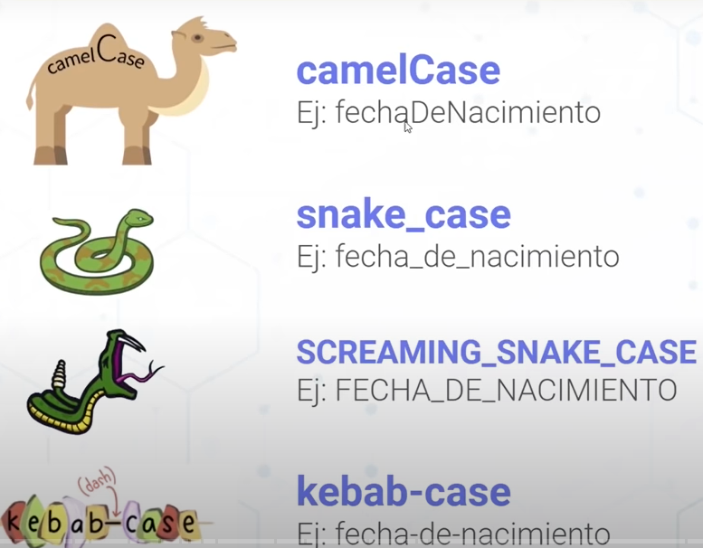
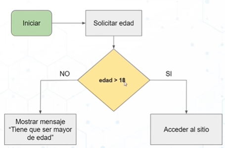
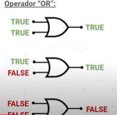

# Conceptos básicos

- Datos: No tiene muchos sentidos por si solos, como una pieza del rompecabezas.
- Información: Se añade un contexto al mensaje cual va a ser su utilidad, en vez de 5 ahora se podría decir que tienes 5 manzanas.
- Conocimiento: Es la habiliadad o experiencia que adquieres al aprender o hacer algo con la información. Utilizar las manzanas para hacer un pay de manzana.

- Variable: Es como una caja en donde guardas datos
- constantes: Cuando se le asigna un valor no cambia a lo largo del programa

## Nomenclatura:
  - Malas practicas: sin espacios, no empezar con números, utilizar palabras reservadas.

- Camel Case: se utiliza cuando declaras una variable
- SCREAMING_SNAKE_CASE: para las constantes
- snake_case se mantiene en las bases de datos
- kebab-case solo para las url, nombre de las carpetas
    

## Lenguaje de tipiado fuerte:
- Definir el tipo de dato.
- Python es un lenguaje de tipado dinámico no se tiene que especificar el tipo de dato y tambien de tipo fuerte

# Diagrama de flujo
- Una representación gráfica de todo el sistema

# Operadores Lógicos
- NOT: Lo convierte al opuestro el dato booleano
- AND: Todas las condiciones tienen que cumplirse
- OR: que una de las condiciones se cumpla

## Etapas de usuario

Las solicitudes del usuarios a veces no se entiende y nosotros debemos tratar de ver que es lo que realmente necesita y no como el lo quería.

- Requerimientos funcionales: Se centra en que va a hacer el sistema y como el usuario interactua.
- Requerimientos no funcionales: No esta visible para el usuario y tiene que ver más con la lógica y calidad del sistema para que funcione correctamente.
 
Cuando se programa es necesaria divider en partes más pequeñas las funciones para poder reutilizarlas garantizando buenas practicas.

## Bugs y Debugging

Los bugs son cuando escribes un programa pueden ocurrir errores haciendo que el programa no funcione correctamente

Para arreglar estos errores utilizamos Debugging realizar el paso a paso para saber que esta haciendo tu programa hasta encontrar el error.

Los breakpoints o puntos de interrupción son como las pausas cuando vez una peli para revisar lo que esta sucediendo hasta ese momento.

## Bucles

- while hasta que se cumpla la condición
- Arrays nos pemite guardar datos en una fila